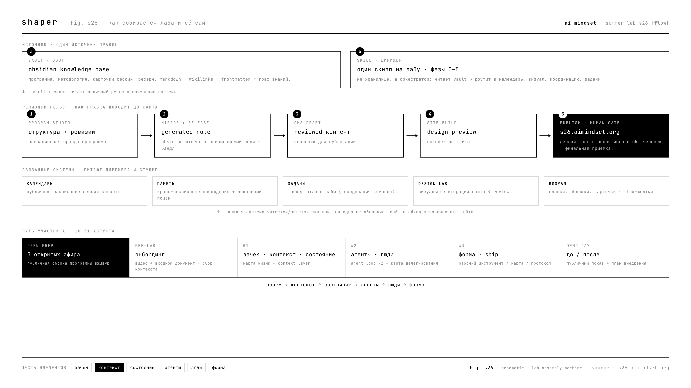

# AI Mindset · Summer Lab S26 {flow}

**поток в эпоху агентов.** трёхнедельная лаборатория, где практики собирают из своего контекста и своих агентов устойчивую рабочую систему и выносят один работающий инструмент.

**сайт лабы → [s26.aimindset.org](https://s26.aimindset.org/)**

---

## что это

S26 {flow} собрана для фаундеров и практиков, у которых уже есть агенты, но продуктивность от них не выросла. ответ лабы прямой: агент работает по контексту о человеке, а контекст разбросан по заметкам, чатам, транскриптам и сохранёнкам. за август участник собирает контекст-слой и профиль для своего агента, прогоняет через него рабочий цикл и выносит один работающий инструмент, карту или протокол.

поток здесь это рабочее состояние, где «час идёт за минуту, а результат превышает усилие». ему учатся: его собирают как систему через среду, отрегулированную нервную систему и защиту фокуса. речная метафора задаёт три фазы месяца: исток → пороги → устье.

> **манифест:** продуктивность складывается из отсечения. собери своё, остальное отсеки.

---

## этот репозиторий

публичная витрина лабы. растёт по мере её развития: сюда попадают программа, принципы и обезличенные артефакты открытых сессий (диаграммы, скиллы, карты подходов). личных данных участников и приватных данных спикеров здесь нет по построению.

| папка | что внутри |
|-------|------------|
| [`program/`](program/) | дуга шести элементов, недели, форматы, проводники, что участник выносит |
| [`principles/`](principles/) | как устроена работа: отсечение, открытая сборка, ритуал завершения сессии, человек в контуре |
| [`streams/`](streams/) | три открытых эфира — публичная сборка программы вживую |
| [`skills/research/`](skills/research/) | обезличенный скилл `/research` — методология: провайдеры, council-линза, оценка доказательств |
| [`glossary/`](glossary/) | термины лабы |
| [`artifacts/`](artifacts/) | артефакты открытых эфиров и сессий, добавляются со временем |
| [`assets/`](assets/) | shaper-диаграммы (png + html) + общий стиль |
| [`STYLE.md`](STYLE.md) · [`CONTRIBUTING.md`](CONTRIBUTING.md) | визуальная грамматика и как растёт репозиторий (публичное / приватное) |

---

## открытая сборка

перед стартом лабы программа собирается **в прямом эфире**: три открытых рабочих сессии, где виден сам процесс сборки образовательного продукта. не продажа готового курса, а показ метода, который можно забрать и развернуть на себя или свою команду.

расписание и запись → [s26.aimindset.org](https://s26.aimindset.org/).

---

## стиль

все диаграммы репозитория сделаны в эстетике **shaper**: чёрно-белый технический язык патентного чертежа, моноширинный шрифт, строчные буквы, рамки 1px, нумерованные выноски, инверсия как активное состояние. цвет не несёт смысла, смысл несёт структура. подробно → [`STYLE.md`](STYLE.md).

---

*built in the open · ai mindset*
