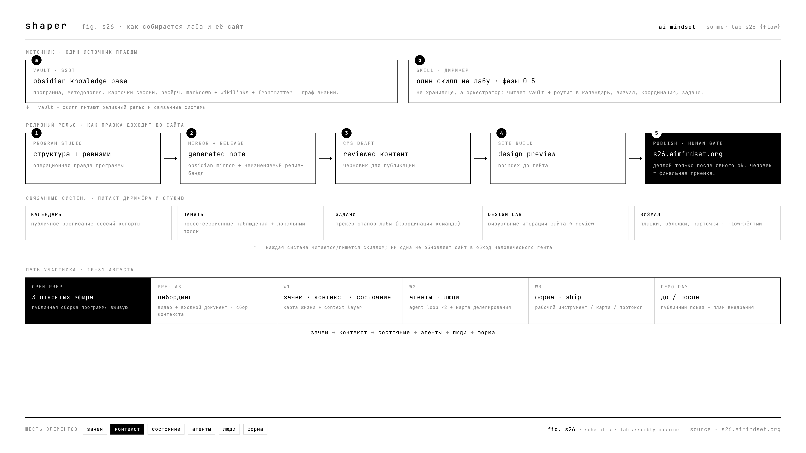

# AI Mindset · Summer Lab S26 {flow}

**поток в эпоху агентов.** трёхнедельная лаборатория, где практики собирают из своего контекста и своих агентов устойчивую рабочую систему и выносят один работающий инструмент.

**сайт лабы → [s26.aimindset.org](https://s26.aimindset.org/)** · 10–31 августа 2026

---

## что это

S26 {flow} собрана для фаундеров и практиков, у которых уже есть агенты, но продуктивность от них не выросла. ответ лабы прямой: агент работает по контексту о человеке, а контекст разбросан по заметкам, чатам, транскриптам и сохранёнкам. за август участник собирает контекст-слой и профиль для своего агента, прогоняет через него рабочий цикл и выносит один работающий инструмент, карту или протокол.

поток здесь это рабочее состояние, где «час идёт за минуту, а результат превышает усилие». ему учатся: его собирают как систему через среду, отрегулированную нервную систему и защиту фокуса. речная метафора задаёт три фазы месяца: исток → пороги → устье.

> **манифест:** продуктивность складывается из отсечения. собери своё, остальное отсеки.

---

## что мы уже отдали

программа лабы собиралась **в прямом эфире**, четырьмя открытыми сессиями. каждая оставила рабочий артефакт, который лежит здесь и работает без лабы.

| эфир | дата | гость | запись | что осталось в репозитории |
|------|------|-------|--------|----------------------------|
| **#1** | 23.07 | Дарья Воронкина · автор канала «AI-шипучка» | [Founder OS #37](https://youtu.be/AXq8yW97FrU) | [`artifacts/flow-compass/`](artifacts/flow-compass/) — плагин-компас продуктивности, собранный вживую в эфире |
| **#2** | 30.07 | Александр Васильев · создатель JARVIS | [Founder OS #38](https://youtu.be/KVihbZL0oB8) | [`guide/`](guide/) — рабочий гайд по сборке личного контекста, десять разделов со схемами |
| **#3** | 05.08 | Кирилл Олейниченко · «Оди», «Журналус», «Адовый UX» | [s26.aimindset.org](https://s26.aimindset.org/) | [`artifacts/kirill-system/`](artifacts/kirill-system/) — шаблоны личной конституции ZTD, восемь слоёв |
| **#4** | 06.08 | Серёжа Рис · personal corp, a2a | [s26.aimindset.org](https://s26.aimindset.org/) | [`artifacts/personal-corp/`](artifacts/personal-corp/) – недельный цикл планирования и ретро с агентом |

как это выглядело: доступ к репозиторию выдавался гостю прямо в эфире, его агент собирал артефакт в реальном времени, PR открывался и мержился при зрителях. артефакт эфира #3 родился за те же девяносто минут, что шёл сам эфир.

---

## как устроен репозиторий

публичная витрина лабы. растёт по мере её развития. личных данных участников и приватных данных спикеров здесь нет по построению — граница описана в [`CONTRIBUTING.md`](CONTRIBUTING.md).

| папка | что внутри | схема |
|-------|------------|-------|
| [`program/`](program/) | дуга шести элементов, три недели с датами, форматы, что участник выносит | [`s26-lab-map`](assets/s26-lab-map.png) |
| [`principles/`](principles/) | семь принципов работы: отсечение, контекст раньше автоматизации, человек в контуре, ритуал завершения | — |
| [`streams/`](streams/) | четыре открытых эфира: темы, записи, что каждый оставил | — |
| [`guide/`](guide/) | **гайд по сборке личного контекста** — элемент 2 дуги, десять разделов | [`context-guide-map`](assets/context-guide-map.png) + 10 фигур |
| [`artifacts/`](artifacts/) | артефакты эфиров и сессий: плагины, шаблоны, скиллы | — |
| [`skills/research/`](skills/research/) | обезличенный скилл `/research`: провайдеры, council-линза, оценка доказательств | [`research-skill-anatomy`](assets/research-skill-anatomy.png) |
| [`glossary/`](glossary/) | термины лабы | — |
| [`assets/`](assets/) | shaper-диаграммы (png + исходный html) и общий `shaper.css` | — |
| [`STYLE.md`](STYLE.md) | визуальная грамматика: как сделать новую схему в том же языке | — |
| [`CONTRIBUTING.md`](CONTRIBUTING.md) | как растёт репозиторий и как проводнику принести свой блок | — |

### схемы

каждая крупная мысль репозитория имеет свою фигуру в едином языке. исходники всех фигур лежат рядом с png в виде html — их можно править и пересобирать.

| фигура | о чём |
|--------|-------|
| [`s26-lab-map`](assets/s26-lab-map.png) | как из vault через скилл-дирижёр и релизный рельс собирается сайт лабы и путь участника |
| [`context-guide-map`](assets/context-guide-map.png) | карта гайда по контексту: десять разделов и связи между ними |
| [`start`](assets/context-fig-start.png) · [`sources`](assets/context-fig-sources.png) · [`layers`](assets/context-fig-layers.png) · [`vault`](assets/context-fig-vault.png) | с чего начать · откуда брать · слои контекста · как это живёт в vault |
| [`rakes`](assets/context-fig-rakes.png) · [`security`](assets/context-fig-security.png) · [`gates`](assets/context-fig-gates.png) · [`failures`](assets/context-fig-failures.png) | грабли · безопасность · человеческие гейты · режимы отказа |
| [`examples`](assets/context-fig-examples.png) · [`generations`](assets/context-fig-generations.png) · [`growth`](assets/context-fig-growth.png) | примеры · поколения системы · как контекст растёт |
| [`research-skill-anatomy`](assets/research-skill-anatomy.png) | анатомия исследовательского скилла: петля, режимы, оценка доказательств |

разделы без своей фигуры — `program`, `principles`, `streams`, `artifacts`, `glossary`. это открытая работа: схему может принести любой проводник или участник по правилам из [`STYLE.md`](STYLE.md).

---

## проводники

лабу ведёт основатель вместе с приглашёнными практиками; каждый закрывает свой блок дуги. github указан рядом с именем, потому что материалы сюда приносят сами проводники и их агенты.

| проводник | что приносит | github |
|-----------|--------------|--------|
| Александр Поваляев | ведущий · контекст, агентные циклы, сборка личных систем | [@aPoWall](https://github.com/aPoWall) |
| Дарья Воронкина | открытие · аудит жизни, контекст и оркестрация агентов, running case-study | [@Voronik1801](https://github.com/Voronik1801) |
| Серёжа Рис | агенты · a2a, personal corp, эмоциональный слой агентной работы | [@serejaris](https://github.com/serejaris) |
| Кирилл Олейниченко | личная система · медиа-кураторство, делегирование, vibe-coding | [@kirillgreen](https://github.com/kirillgreen) |
| Александр Васильев | инфраструктура · личная ai-ос, открытая клиника, хакатоны-сборки | [@alexfrmn](https://github.com/alexfrmn) |
| Анка Ставенски | форма · визуальное направление и публикация | [@eppelas](https://github.com/eppelas) |
| Станислав Федосеев | агентные системы · архитектура контекста | – |
| Станислав Глазов | процедурная практика состояния · мульти-агентные системы | – |

три гостевые сессии по четвергам ведут приглашённые практики со своей темой:

| гость | сессия | github |
|-------|--------|--------|
| Тоня Жукова | баланс нагрузки и устойчивость фаундера · женская позиция и специфика нагрузки | [@tonyazhuuki](https://github.com/tonyazhuuki) |
| Сергей Булаев | контент как инженерная система · агенты, которые публикуют | – |
| Майк Ян | intention os · личная ai-система, фаундер manychat | – |

прочерк значит, что хендл ещё не сверен с человеком, а не что его нет. так же устроены и артефакты: пустая строка честнее выдуманной.

**актуальные даты и живое расписание — на [сайте лабы](https://s26.aimindset.org/).**

---

## лабу собирают люди и их агенты

программа не пишется сверху вниз. она собирается из контекстов участников через призму их агентов: у каждого есть агент-представитель, который держит рабочий контекст, а обмен между агентами сравнивает практики. из этих сверок растёт общий контекст лабы и карта подходов.

этот репозиторий устроен так же. значительная часть того, что здесь лежит, написана агентами проводников по их материалу и принята человеком:

- гайд по контексту вырос из эфира и разбора личной инфраструктуры;
- плагин компаса собран вживую при зрителях;
- шаблоны конституции продиктованы агенту голосом и замержены в кадре.

правило одно и общее для человека и агента: **черновик собирает кто угодно, принимает человек**. подробности — в [`principles/`](principles/) и [`CONTRIBUTING.md`](CONTRIBUTING.md).

---

## стиль

все диаграммы репозитория сделаны в эстетике **shaper**: чёрно-белый технический язык патентного чертежа, моноширинный шрифт, строчные буквы, рамки 1px, нумерованные выноски, инверсия как активное состояние. цвет не несёт смысла, смысл несёт структура. подробно → [`STYLE.md`](STYLE.md).

---

*built in the open · ai mindset*
