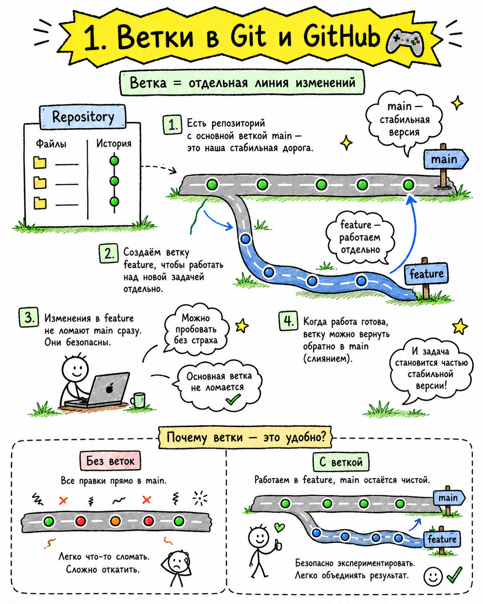
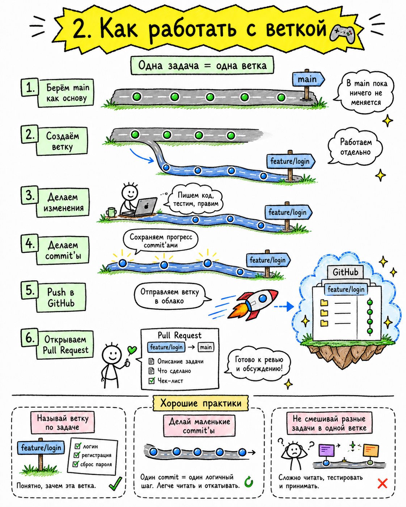
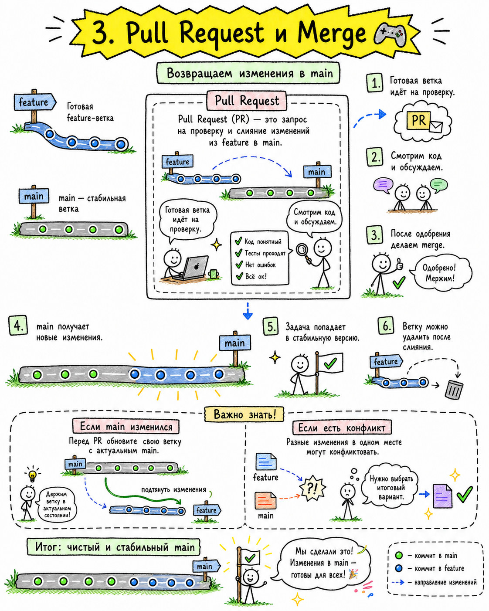

# git · пререквизит

Перед personal corp. Не курс по git. Три картинки = одна идея: своя линия работы → review → merge.

То же самое потом с агентом: черновик в своей папке → ты смотришь → принимаешь.

| git | personal corp |
|-----|----------------|
| ветка от main | отдельная линия, база цела |
| feature branch | одна задача в своей полосе |
| PR + review + merge | агент готовит → ты принимаешь |

## 1. ветки

Main и feature живут рядом. Одна не ломает другую.

## 2. работа в ветке

Коммиты идут в свою линию. Эксперимент изолирован.

## 3. PR и merge

Черновик → review человеком → слияние в main. Без review = лотерея.

Дальше: [README](README.md)
