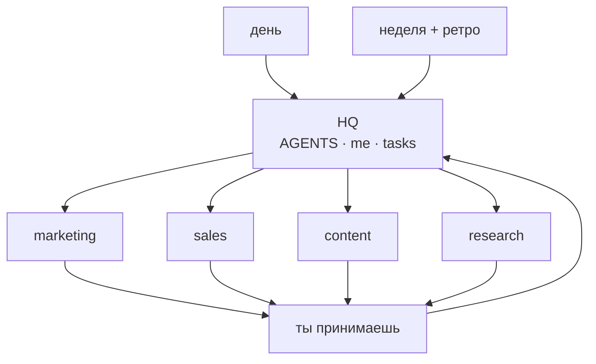
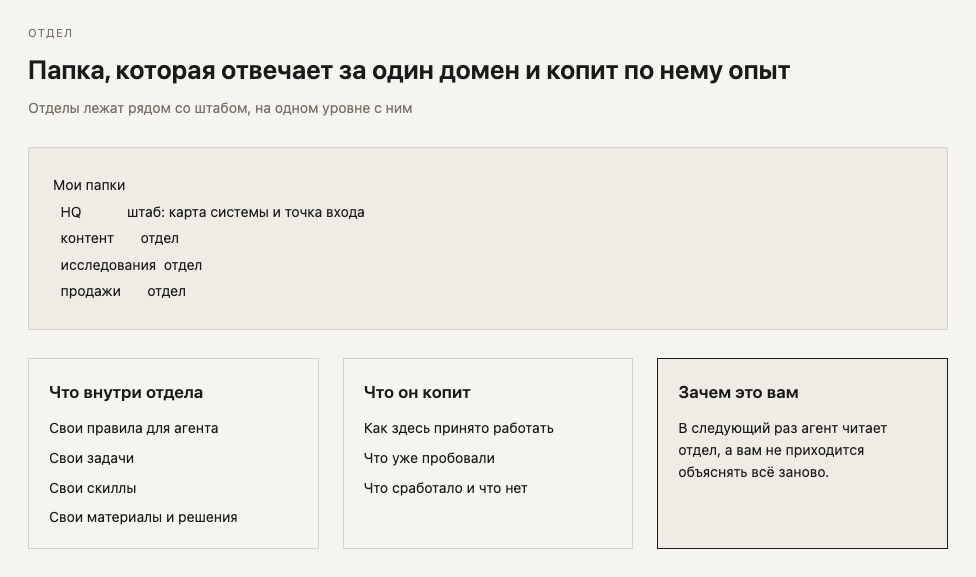

# personal corp · эфир #4

**06.08.2026** · Серёжа Рис × Алекс Поваляев · [запись](https://s26.aimindset.org/)

Пререквизит: [00-git-prereq](00-git-prereq.md) (ветки → review → merge).

## сделай сейчас (~15 мин)

1. Скопируй штаб: https://github.com/serejaris/personal-corp-os/tree/main/templates/hq
2. Заполни `me.md` своими словами.
3. Запусти агента **из этой папки**.
4. Спроси: «прочитай AGENTS и me — что у меня в фокусе?»

Отдел рядом со штабом (не внутри): https://github.com/serejaris/personal-corp-os/tree/main/templates/department

---

## схема





---

## три навыка (топ-0)

1. Агент стартует в папке. YouTube-папка = ютуб. HQ = ты и неделя. Из ютуба он не лезет в Legal.
2. Markdown руками. Человек читает смысл, агент читает структуру.
3. В папке лежит `AGENTS.md`. Агент читает его первым и надевает роль этой папки.

Та же логика, что в [git-пререквизите](00-git-prereq.md): своя линия → review → merge.

---

## уровни интерфейса

Меняй уровень только если упёрся.

| уровень | что | хватает когда |
|---------|-----|----------------|
| 1 терминал | CLI-агент в папке | одна задача |
| 1.5 orca и аналоги | папки слева, превью md | несколько проектов |
| 2 gui | Cursor, Codex app | удобный редактор + сессии |

«У соседа красиво» — плохая причина менять уровень.

---

## день и неделя

**День (~10 мин утром):** выгрузи голову агенту → 3 пункта на сегодня → вечером 5 строк следа.

**Неделя:** план в начале → дни → ретро в конце. Ретро: что сдвинулось, что врало, что в next.

В голове держи два якоря: HQ и база знаний. Остальное открывай по нужде.

---

## отделы

Отдел = папка с правилами, задачами и своим опытом. Скилы отдела лежат внутри отдела.

Work и personal в разных корзинах. Личное в рабочем контексте чаще мешает.

---

## задача a→b

```markdown
# задача

a: сейчас так
b: станет так
done: когда можно принять
следующий шаг: одно действие
```

Без критерия done проекты горят бесконечно.

---

## приёмка (ты)

Агент пишет черновик. Ты мержишь.

- [ ] факты проверены
- [ ] не вышел из папки / scope
- [ ] готов показать завтра
- [ ] критерий done выполнен
- [ ] accept / reject + дата

Ты всегда узкое горлышко. Выбери, где именно, и проверяй спокойно.

---

## 5 правил

1. Сначала руками, потом pipeline.
2. Одна папка = один контекст.
3. Work и personal раздельно.
4. Bottleneck осознанный.
5. Черновик принимает человек.

---

Полный OS и шаблоны: [personal-corp-os](https://github.com/serejaris/personal-corp-os)  
Шаблон штаба: https://github.com/serejaris/personal-corp-os/tree/main/templates/hq
