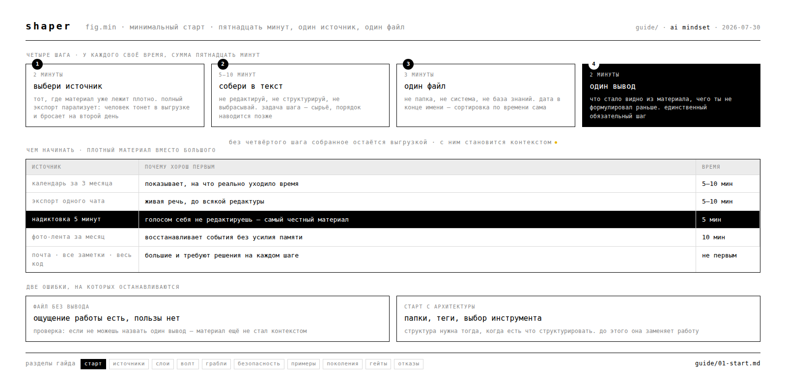

# 01 · минимальный старт



пятнадцать минут. один источник. один файл. без волта, без инструментов, без архитектуры.

этот раздел существует, потому что декабрьская лаба показала готовые системы и получила фрустрацию: разрыв между демо продвинутого контура и вопросом «а мне-то что делать» оказался непроходимым. поэтому здесь нет ничего, кроме первого шага.

---

## почему один источник, а не всё сразу

полный экспорт кажется правильным началом: выгрузить всё, потом разобрать. на практике человек тонет в выгрузке и бросает на второй день. объём материала не помогает — он парализует.

один источник даёт обратное: через пятнадцать минут есть результат, который можно потрогать, и понимание, стоит ли продолжать.

---

## шаг 1 · выбери источник (2 минуты)

бери тот, где материал уже накоплен и лежит плотно. хорошие первые источники:

| источник | почему хорош | сколько занимает |
|---|---|---|
| календарь за 3 месяца | показывает, на что реально уходило время | 5–10 мин |
| экспорт одного чата | живая речь, а не отредактированная | 5–10 мин |
| голосовая надиктовка 5 минут | самый честный материал (см. ниже) | 5 мин |
| фото-лента за месяц | восстанавливает события без усилия памяти | 10 мин |

плохие первые источники: почта, все заметки сразу, весь GitHub. они большие и требуют решений на каждом шаге.

## шаг 2 · собери (5–10 минут)

выгрузи выбранное в текст. не редактируй, не структурируй, не выбрасывай. на этом шаге задача — получить сырьё, а не порядок.

**про голос отдельно.** текстом человек редактирует себя на лету: убирает неловкое, формулирует красивее, чем думает. голосом — нет. пять минут надиктовки дают больше настоящего материала, чем час письма. если сомневаешься, с чего начать, начни с голоса: включи запись и ответь вслух на три вопроса.

> что занимало меня последние три месяца
> что я откладываю дольше всего
> что я делаю руками каждую неделю, хотя не должен

## шаг 3 · один файл (3 минуты)

всё собранное — в один файл. один. не папка, не система, не база знаний.

назови его так, чтобы через полгода понять, что внутри, не открывая:

```
контекст источник-<какой> – ГГГГ-ММ-ДД.md
```

дата в конце — чтобы файлы сортировались по времени сами.

## шаг 4 · один вывод (2 минуты)

в конец файла допиши один абзац: **что стало видно из этого материала, чего ты не формулировал раньше.**

это единственный обязательный шаг. без него собранное остаётся выгрузкой. с ним оно становится контекстом.

---

## что дальше

через пятнадцать минут у тебя есть один файл с сырьём и одним выводом. этого достаточно, чтобы:

- отдать его агенту и посмотреть, изменится ли качество ответа
- понять, стоит ли собирать второй источник
- ничего больше не делать, если не зашло

**следующий слой добавляется только тогда, когда текущий начал мешать.** пока один файл справляется — второго не нужно. когда файлов станет больше десятка и ты перестанешь помнить, где что, переходи к [хранению слоями](03-layers.md).

карта того, какие источники вообще бывают и в каком порядке их брать, — в [карте источников](02-sources.md).

---

## частая ошибка на этом шаге

собрать источник и не сделать шаг 4. файл лежит, ощущение работы есть, пользы нет. проверка простая: **если ты не можешь назвать один вывод, материал ещё не стал контекстом.**

вторая по частоте — начать с архитектуры. нарисовать структуру папок, придумать теги, выбрать инструмент, и на этом закончиться. структура нужна, когда есть что структурировать.
