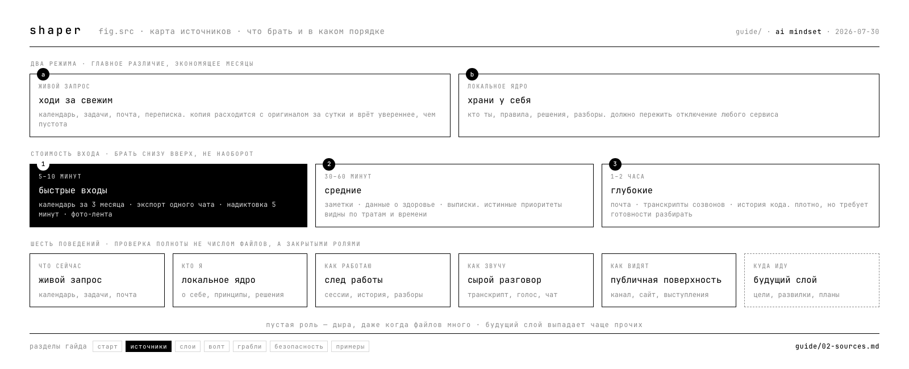

# 02 · карта источников

когда первый источник собран и вывод сделан, встаёт вопрос: что брать дальше и в каком порядке. этот раздел — карта, а не программа. пройти всё подряд не нужно и вредно.

---

## два режима: живой запрос и локальное ядро

главное различие, которое экономит месяцы.

**живой запрос** — источник, к которому ходишь за свежим каждый раз. календарь, задачи, почта, CRM, переписка. копию такого источника хранить не нужно: она расходится с оригиналом за сутки и начинает врать увереннее, чем отсутствие данных.

**локальное ядро** — то, что хранишь у себя и что должно пережить отключение любого сервиса. кто ты, твои правила, решения и почему они приняты, разборы, транскрипты.

частая ошибка — выгрузить календарь в заметки «чтобы всё было в одном месте». через неделю там прошлое, которое выглядит как настоящее.

---

## источники по стоимости входа

| время | источник | что даёт |
|---|---|---|
| **5–10 мин** | календарь · экспорт чата · голосовая надиктовка · фото-лента | быстрый результат, проверка интереса |
| **30–60 мин** | заметки · данные о здоровье · банковские выписки | истинные приоритеты — по тратам и по времени видно то, что не совпадает с декларациями |
| **1–2 часа** | почта · транскрипты созвонов · история кода | плотный материал, но требует готовности разбирать |

порядок — по возрастанию. брать глубокий источник первым значит увеличить шанс бросить.

---

## шесть поведений: чем проверить полноту

не «сколько источников собрано», а **какие роли закрыты**. если роль пустая — это дыра, даже когда файлов много.

| поведение | что закрывает | примеры |
|---|---|---|
| **живой запрос** | что происходит сейчас | календарь, задачи, почта, переписка |
| **локальное ядро** | кто я и по каким правилам живу | о себе, принципы, решения |
| **след работы** | как я на самом деле работаю | сессии с агентом, история изменений, разборы |
| **сырой разговор** | как я звучу, а не как себя описываю | транскрипты, голос, групповые чаты |
| **публичная поверхность** | каким меня видят снаружи | канал, сайт, выступления |
| **будущий слой** | куда я иду | цели, открытые развилки, планы |

последняя строка выпадает чаще всего. контекст без будущего слоя описывает прошлое и не помогает принимать решения.

---

## что делать с чувствительным

терапия, здоровье, отношения, деньги, семья — самый плотный материал и самый опасный.

рабочее правило: **обезличить до отправки либо не отправлять.** конкретно это значит — убрать имена, места, узнаваемые детали, оставить механику и паттерн. «разговор с N о переезде» превращается в «повторяющийся конфликт между обязательством и свободой перемещения».

то, что не поддаётся обезличиванию, остаётся локально и в облако не идёт. это не паранойя, а условие честности: контекст, который страшно отдать, отдаётся выборочно — и тогда система работает с тем, что есть, а не с искажённым.

---

## как понять, что источников достаточно

честный ответ: устойчивого критерия нет, и это открытое место гайда.

рабочая проверка на сегодня — **задай агенту вопрос, который требует знания тебя, и посмотри, промахнётся ли он.** если ответ общий, не хватает локального ядра. если ответ устарел, не хватает живого запроса. если ответ вежливый и обтекаемый, не хватает сырого разговора.

собирать «на всякий случай» — способ не начать работать. контекст собирается под задачу.
