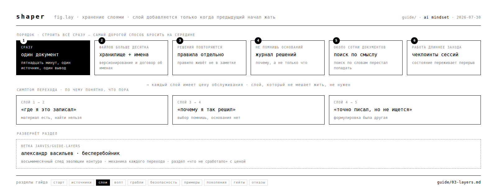

# 03 · хранение слоями

раздел для момента, когда одного файла перестало хватать. шесть слоёв, симптом перехода к каждому, цена обслуживания. в конце — что из этого за восемь месяцев не сработало, с ценой каждого пункта.

всё ниже снято с системы, которая живёт с октября 2025 по сегодня. команды, которыми получены цифры, приведены рядом.

---

## принцип

слой добавляется, когда предыдущий начал мешать. пока текущий справляется, следующий добавляет обслуживание и ничего не даёт.

строить архитектуру заранее дорого по одной причине: усилие уходит в инфраструктуру, которая ещё ничего не держит, результат не появляется достаточно быстро, и работа бросается на середине.

---

## шесть слоёв

| # | слой | симптом перехода | цена обслуживания |
|---|------|------------------|-------------------|
| 1 | один документ | — | нулевая |
| 2 | хранилище с договором об именах | файлов больше десятка, перестал находить своё | договор надо соблюдать |
| 3 | правила отдельно от заметок | одно решение принимается заново третий раз | правила устаревают молча |
| 4 | решения с записью «почему» | вернулся к выбору и не помнишь оснований | минута на решение |
| 5 | поиск по смыслу | около сотни документов, поиск по словам мимо | индекс надо пересобирать |
| 6 | чекпоинты сессий | работа длиннее одного захода, между заходами теряется | снимок в конце каждой сессии |

---

## переход 1 → 2 · договор об именах

**симптом.** ищешь свой же файл дольше минуты.

механика описана в разделе [волт](04-vault.md): тип живёт в имени файла, дата в конце, имя латиницей.

**что происходит с предыдущим слоем.** первый файл никуда не девается: получает имя по договору и становится первым документом хранилища. содержание переписывать не нужно.

---

## переход 2 → 3 · правила отдельно от заметок

**симптом.** одно и то же решение принимается заново третий раз, и каждый раз чуть иначе. прошлое решение лежит в заметке, а заметка читается один раз.

**механика.** правило отделяется от заметки и получает проверяемое условие. проверка: **у правила есть триггер — момент, когда оно срабатывает.**

«больше отдыхать» условия не содержит и проверке не поддаётся. «семь часов сна минимум, стоп в двадцать три ноль-ноль» содержит время и действие, поэтому проверяется.

**наблюдение с восьмимесячной дистанции.** пять принципов, собранных в декабре 2025, за это время не изменились ни разу. цели того же года переписаны полностью. принципы описывают поведение и переживают смену планов; цели описывают планы и меняются вместе с ними.

цена: правило устаревает молча. пересматривать список стоит тогда, когда ловишь себя на регулярном его нарушении.

---

## переход 3 → 4 · решения с записью «почему»

**симптом.** возвращаешься к старому выбору, помнишь результат, оснований не помнишь. дальше выбор либо переоткрывается с нуля, либо защищается по инерции.

**механика.** к каждому значимому решению записывается три вещи: что выбрано, какие были альтернативы, почему выбрано это. запись занимает минуту.

**цифра.** на измеряемой системе 2306 таких записей за восемь месяцев. ответ на вопрос «почему мы это выбрали» подешевел с получаса раскопок до одного запроса.

через три месяца «почему» стоит дороже, чем «что»: результат виден в файлах, основания не видны нигде.

---

## переход 4 → 5 · поиск по смыслу

**симптом.** документов около сотни, поиск по словам перестаёт находить: ты помнишь суть, а слово из заголовка не воспроизводится.

**механика.** поверх хранилища встаёт индекс, который ищет по значению.

**порядок, который экономит неделю.** сначала обычный полнотекстовый поиск с синонимами. индекс по смыслу оправдан тогда, когда массив размечен и полнотекстовый поиск честно перестал справляться. обратный порядок стоит нескольких дней, потраченных на инфраструктуру, которая пока ничего не улучшает.

цена: индекс отстаёт от файлов и требует пересборки. отстающий индекс отвечает уверенно и неверно.

---

## переход 5 → 6 · чекпоинты сессий

**симптом.** работа идёт длиннее одного захода, и каждый следующий начинается с восстановления контекста.

**механика.** в конце захода пишется снимок: что сделано, что осталось открытым, где лежат артефакты. следующий заход начинается с чтения снимка.

**цифра.** 230 снимков за восемь месяцев. они же оказались единственным способом восстановить хронологию: содержание файлов показывает состояние, снимки показывают движение.

---

## текст против гейта

главное, что стоило дороже всего.

**механика.** контекст, записанный текстом, читается один раз на старте и дальше конкурирует с вниманием. контекст, встроенный в момент действия, срабатывает независимо от того, помнишь ты о нём.

**цифра, снятая при разборе 29 июля 2026.** в системе накоплено 114 файлов с разборами собственных ошибок против 3 проверок, физически останавливающих действие. в тот же день произошло четыре промаха, и **три из четырёх были покрыты правилами, лежавшими в контексте в ту же секунду.** правила прочитаны, приняты и не сработали.

в тот же день добавлено шесть останавливающих проверок. текстовые разборы остались на месте: они объясняют, почему проверка стоит там, где стоит.

**практическое следствие.** разобрал свою ошибку — назови, что физически остановит руку в следующий раз. механики нет — скажи это вслух: «здесь только текст». осознанный выбор работает, забывчивость нет.

вопрос при добавлении любого правила: **что произойдёт в момент, когда это понадобится.**

---

## что не сработало

каждый пункт стоил времени. цена указана.

### чистка без замера убивает темы

**симптом.** после наведения порядка тема перестаёт всплывать в работе, обнаруживается это случайно и месяцами позже.

**причина.** свёрнутый раздел выглядел завершённым нарративом, а был рабочим контуром с открытыми хвостами.

**цена.** одна тема схлопнулась с восьми упоминаний до двух и фактически исчезла. нашлась по совпадению.

**решение.** замер тем до сжатия, замер после, сравнение. всё, что упало в ноль, обязано жить в другом месте. сворачивается завершённое, рабочее остаётся.

### архив читается как рабочий контур

**симптом.** находка записана, через сутки её никто не помнит, решения принимаются без неё.

**причина.** запись ушла в архивное хранилище, которое в работе не открывается.

**цена.** деградация оборудования, зафиксированная вечером, выпала из следующего дня и нашлась случайно.

**решение.** определить два-три места, которые читаются каждый раз. запись, не попавшая ни в одно, потеряна молча.

### молчаливые лимиты

**симптом.** часть контекста не доезжает до работы, ошибки при этом нет.

**причина.** у файла, который подгружается автоматически, есть жёсткий лимит. за лимитом хвост обрезается без предупреждения.

**цифра.** лимит 25 600 байт, текущий размер 22 797 — 89 процентов. до постановки сторожа обрезание обнаруживалось через сессию, уже после потери.

**решение.** узнать лимиты своих инструментов и поставить проверку на приближение. отсутствие ошибки работу не доказывает.

### единый системный промпт перестаёт масштабироваться

**симптом.** правишь один файл и ломаешь три поведения.

**причина.** в одном документе живут вещи с разным сроком жизни: неизменное соседствует с тем, что меняется еженедельно.

**решение.** разделить по скорости изменения: неизменное · правила с проверками · рабочие заметки · история решений. компактный документ работает, пока помещается в голову целиком.

### зелёный результат при нулевой работе

**симптом.** проверка отвечает «всё чисто», и это неправда.

**причина.** проверка отработала на пустом входе: сравнивать было нечего, а результат выглядит как успех.

**цена.** три таких случая за один день: проверка на пустом наборе изменений, детектор при недостижимой цели, счётчик, вернувший ноль на пустом входе и прочитанный как «ноль проблем».

**решение.** результат, ровно равный ожиданию при нулевой работе, считать красным флагом. спрашивать, что конкретно было прочитано, чтобы получить такой ответ.

---

## что здесь неполно

- **что появляется после шестого слоя** — на системе видно, обобщения пока нет
- **как слои ведут себя при смене инструмента** — проверено на одном стеке
- **сколько слоёв нужно человеку, который не работает с агентами ежедневно** — есть подозрение, что три, замера нет

опыт по любому пункту ценнее ещё одного раздела от авторов — [как добавить](CONTRIBUTING.md).
