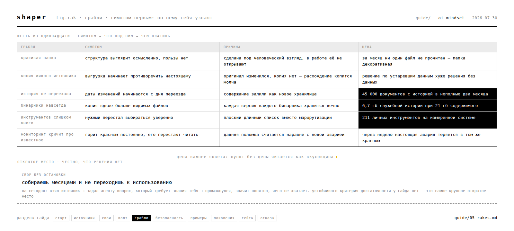

# 05 · грабли

без этого раздела гайд был бы рекламой. каждый пункт — симптом, настоящая причина и цена. симптом стоит первым: по нему себя узнают.

прочитать стоит заранее, вернуться — когда заболит.

---

## красивая папка вместо рабочих файлов

**симптом.** структура выглядит осмысленно, ощущение порядка есть, пользы нет.

**причина.** папка сделана для человеческого взгляда, а не для чтения. ни один файл из неё не открывается в работе.

**проверка.** если за месяц ни один файл из папки не был прочитан ни разу — папка декоративная. удалить или свести в один рабочий файл.

---

## копия того, что есть в живом источнике

**симптом.** выгруженный календарь или список задач начинает противоречить настоящему, и ты доверяешь копии.

**причина.** живой источник изменился, копия — нет. расхождение накапливается молча.

**цена.** решение, принятое по устаревшим данным, хуже решения, принятого без данных: во втором случае ты хотя бы осторожен.

---

## сырое чувствительное в облако

**симптом.** обнаруживаешь, что личный материал ушёл в сервис, и начинаешь отдавать системе меньше — она глупеет.

**причина.** нет привычки обезличивать до отправки, поэтому выбор бинарный: всё или ничего.

**решение.** убрать имена и узнаваемые детали, оставить механику. то, что не обезличивается, остаётся локально.

---

## история не переезжает вместе с содержанием

**симптом.** через полгода после смены машины замечаешь, что даты изменений начинаются с дня переезда, а всё, что было до, — один снимок.

**причина.** при переносе содержание залили как новое хранилище. содержание живо, эволюция — нет.

**цена.** если контекст ценен именно ростом — «когда я это понял, что было до», — ответа больше нет.

**решение.** решать про историю **до** переезда. либо переносить хранилище целиком, либо принять чистый снимок и хотя бы зафиксировать дату разрыва отдельной записью.

реальный случай: личное хранилище с сорока пятью тысячами документов имеет историю глубиной в неполные два месяца — всё предыдущее существует как содержание без дат.

---

## бинарные файлы остаются навсегда

**симптом.** копия хранилища занимает вдвое больше, чем видимые файлы, и качается всё дольше.

**причина.** система версий хранит каждую версию каждого бинарника вечно. удаление файла историю не уменьшает.

**цена.** измеренная: 6,7 ГБ служебной истории при 21 ГБ содержимого. платит каждая новая машина и каждая копия.

**решение.** рендеры, сборки и медиа не живут вместе с текстом. исходники читаются из хранилища, результат складывается отдельно.

---

## операционная система умеет закрывать доступ

**симптом.** программа не может прочитать файл, который прекрасно открывается руками. ошибка выглядит как повреждение данных.

**причина.** на macOS папки вроде `Documents` защищены механизмом приватности, и фоновый процесс получает отказ, хотя пользователь доступ имеет.

**решение.** рабочие данные автоматизации держать вне защищённых папок. на отказ доступа реагировать как на запрет, а не как на порчу.

---

## кириллица в имени файла

**симптом.** ссылки рвутся, синхронизация ведёт себя странно, часть инструментов файл не видит.

**решение.** имя латиницей, содержание на любом языке. правило вводится только вперёд: старое не переименовывают, иначе рвутся все существующие ссылки.

---

## рассказ о системе вместо системы

**симптом.** человек уверенно описывает стройный контур, а в файлах россыпь.

**причина.** описание системы приятнее её сборки, и память достраивает намерения до фактов.

**проверка.** доказательство — файлы, типы и связи. не пересказ. это относится и к собственной системе: спроси себя, где лежит то, о чём ты только что рассказал.

---

## слишком много инструментов

**симптом.** набор расширений и навыков вырос, и нужный перестаёт выбираться уверенно.

**цифра.** на измеренной системе — 211 личных инструментов, что заметно выше порога уверенного выбора.

**решение.** маршрутизация: один вход, который раздаёт, вместо длинного плоского списка.

---

## наблюдение, которое кричит про известное

**симптом.** мониторинг горит красным постоянно, и его перестают читать.

**причина.** давняя известная поломка считается наравне с новой аварией.

**цена.** через неделю пропускается настоящая авария — она теряется в том же красном.

**решение.** разделять «чинится сегодня» и «известный долг». второе показывать, но не давать ему портить общий вердикт.

---

## сбор без остановки

**симптом.** собираешь месяцами и никогда не переходишь к использованию.

**причина.** критерия достаточности нет, а сбор ощущается как работа.

**решение на сегодня.** контекст собирается под задачу. взял источник — задал агенту вопрос, который требует знания тебя, — посмотрел, промахнулся ли он. промахнулся — понятно, чего не хватает. попал — собирать дальше пока не нужно.

честно: устойчивого критерия остановки у гайда нет, это [открытое место](CONTRIBUTING.md).
