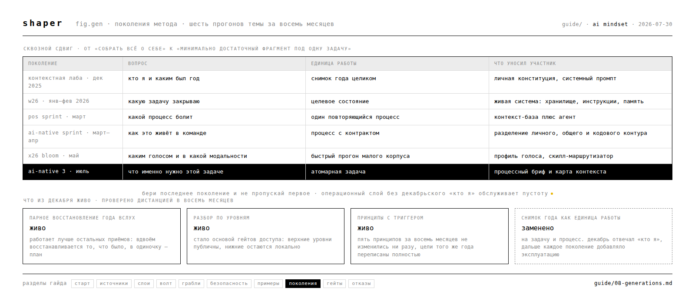

# 08 · поколения метода

раздел для двух случаев: ты нашёл материалы прошлого потока и хочешь понять, актуальны ли они, либо тебе нужно объяснение, почему гайд устроен именно так.

за восемь месяцев AI Mindset прогнали тему контекста шесть раз, и каждый раз метод смещался. материалы всех шести лежат в открытом доступе, поэтому попасть на предыдущее поколение легко.

источник раздела — сплошное чтение архивов: контекстная лаборатория (декабрь 2025), W26 (97 файлов), X26 Bloom (78), AI-Native Sprint вместе с AI-Native 2 (214), AI-Native 3 вместе с POS Sprint (72).

---

## сквозной сдвиг

**от «собрать всё о себе» к «минимально достаточный фрагмент под одну задачу».**

декабрь отвечал на вопрос «кто я». дальше каждое поколение добавляло эксплуатацию: отобрать под задачу, держать актуальным, отдать агенту, превратить в действие. к июлю формулировка стала жёсткой: **контекст — минимально достаточный фрагмент данных, правил и ограничений для одной конкретной задачи. лишний материал ухудшает ответ.**

практический вывод для читателя: **бери последнее поколение и не пропускай первое.** операционный слой без декабрьского «кто я» обслуживает пустоту.

---

## шесть поколений

| поколение | вопрос | единица работы | что уносил участник |
|---|---|---|---|
| контекстная лаба · дек 2025 | кто я и каким был год | снимок года целиком | личная конституция, системный промпт |
| W26 · янв–фев 2026 | какую задачу закрываю | целевое состояние | живая система: хранилище, инструкции, память |
| POS Sprint · март | какой процесс болит | один повторяющийся процесс | контекст-база плюс агент |
| AI-Native Sprint · март–апр | как это живёт в команде | процесс с контрактом | разделение личного, общего и кодового контура |
| X26 Bloom · май | каким голосом и в какой модальности | быстрый прогон малого корпуса | профиль голоса, скилл-маршрутизатор |
| AI-Native 3 · июль | что именно нужно этой задаче | атомарная задача | процессный бриф и карта контекста |

---

## что каждое поколение добавило к методу

### контекстная лаба · снимок года

приёмы разобраны в [примерах](07-examples.md). сюда из декабря переходит одно наблюдение с дистанции: **принципы переживают смену планов, цели меняются вместе с ними.** пять принципов, собранных в декабре, за восемь месяцев не изменились ни разу; цели того же года переписаны полностью.

честная деталь из архива: заявленный на четвёртую сессию артефакт по метрикам и корреляциям участниками не создавался — сессию заняли другие практики. запрос на метрики жизни закрылся на сорок процентов, и это до сих пор самое слабое место темы.

### W26 · контекст под задачу

главный вклад — рабочий цикл, который применим сразу:

**целевое состояние → что неизвестно → какой контекст это закрывает → сбор → промпт → итерация.**

задача идёт первой, данные вторыми. отсюда же два приёма, которые дают эффект в первый день:

- **проверка основания.** после загрузки контекста спросить: «докажи, откуда ты это знаешь». ловит выдумку мгновенно.
- **сжатие после диалога.** в конце длинного разговора попросить суммировать, что модель узнала о тебе, и положить результат в базовый контекст.

там же появилась матрица **важность × частота обновления**: она решает, что живёт в ядре, а что подтягивается по запросу.

### POS Sprint · процесс вместо темы

сдвиг входа: сборка начинается с боли, не с данных. «автоматизировать маркетинг» — направление; атомарная задача — то, что человек делает за один присест.

добавленная механика:

- **плотный self-файл** персонализирует агента лучше, чем масса старых заметок. в разобранном кейсе он закрывал большую часть коммуникационных задач.
- **сначала полнотекстовый поиск с синонимами и дешёвой моделью.** индекс по смыслу оправдан на размеченном массиве. обратный порядок стоит нескольких дней.
- **два файла держат длинную работу:** декомпозиция и текущая позиция. переживает смену сессии и машины.
- **детерминированный скрипт с проверяемым выводом** бывает устойчивее живого подключения к сервису: подключение занимает контекст и хуже валидируется. выбор по задаче.

грабля оттуда же: **чужой скилл не становится качественным от авторитета автора.** качество выясняется на твоих задачах.

### AI-Native Sprint · контур вместо папки

поколение про то, что происходит, когда контекст перестаёт быть личным.

- **три контура:** личный приватный, общий командный, кодовый для тяжёлых артефактов. разделение по хранилищам работает, разделение по папкам ломается — механика в разделе [волт](04-vault.md).
- **растущие структурированные данные живут в базе,** а не в заметках.
- **организационный контекст собирается лестницей:** сырые источники → факты, привязанные к сущностям → два-три коротких файла синтеза, которые входят в каждую сессию. у каждого извлечения сохраняется источник.
- **контракт автономности:** подготовка → план → задачи → проверка. повторяемые точные шаги заменяются обычным кодом, важные решения проходят через человека.
- **задача живёт в трекере.** мессенджер перестаёт быть единственной памятью.

### X26 Bloom · модальности и голос

- **профиль голоса** собирается интервью по собственным примерам. правило продвижения наблюдения в правило: подтверждение независимыми примерами. один пример паттерном не является.
- **узкое место конвейера — разметка смысловых единиц, а не накопление записей.** участница, дошедшая до конца, вывела оси: обстоятельства, действие, событие, тип отношений. без разметки получается склад транскриптов.
- **скилл-маршрутизатор вместо склада знаний:** короткая инструкция направляет к отдельным файлам.
- **быстрый прогон малого корпуса через весь путь** раньше показывает, где система упрётся, чем полировка первого шага.

ретроспективная оценка участников: поток был самым хаотичным из пройденных, и этот хаос помог части группы выйти из аналитического паралича к неотполированному, но готовому результату.

### AI-Native 3 · бриф и карта контекста

последнее поколение довело вход до процедуры:

1. выбрать процесс с явной болью, докопаться до настоящей потребности через «пять почему»
2. **процессный бриф:** владелец · частота · боль · входы · выход · критерий готовности
3. **карта контекста:** источник · где лежит · зачем · насколько чувствителен · используется ли реально
4. **измеримые критерии** вместо «сделай хорошо»: письмо готово без правок, риски названы, решение принимается за пять минут
5. один цикл руками с сохранением промежуточных артефактов
6. **явная передача человеку:** финальное решение и ответственность агенту не уходят

там же зафиксировано деление материала по обработке: **сырое · нормализованное · производное**, подготовленное под конкретную работу агента.

ограничение оттуда же: **длинные сессии без правил закрытия** смешивают темы и раздувают контекст. рабочее ограничение — одна задача на сессию.

---

## что из декабря живо

| приём | статус |
|---|---|
| парное восстановление года вслух | живо, работает лучше остальных приёмов |
| разбор по уровням от окружения к смыслу | живо, стало основой гейтов доступа |
| голос как первичный ввод | живо, усилено разметкой смысловых единиц |
| принципы с триггером | живо, восемь месяцев без изменений |
| снимок года целиком как единица работы | заменено на задачу и процесс |
| разовый экспорт источников | дополнено живым запросом к сервисам |
| метафоры фильтрации | сохранены как язык, механика прописана отдельно |

---

## что здесь неполно

- **поколения после июля** — S26 идёт сейчас, его вклад в этот раздел появится по итогам
- **что из этого работает у человека вне AI-контура** — все шесть потоков собирали людей, уже заинтересованных темой
- **обратная совместимость** — переносится ли система, собранная по первому поколению, на процедуру шестого без пересборки, никем не проверялось

опыт по любому пункту ценнее ещё одного раздела от авторов — [как добавить](CONTRIBUTING.md).
