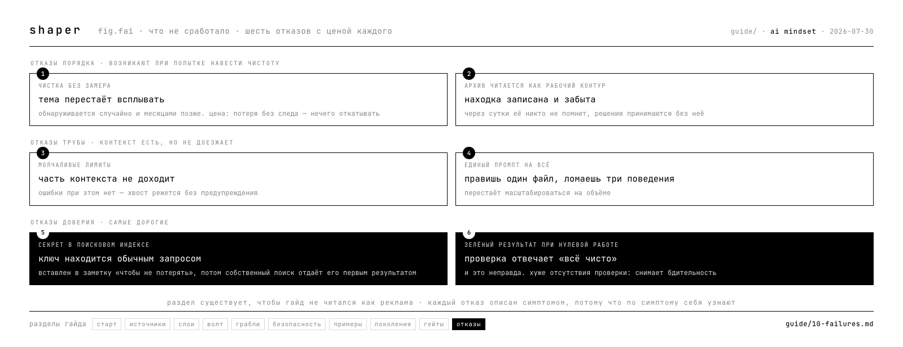

# 10 · что не сработало

продолжение раздела [грабли](05-rakes.md), с той же схемой: симптом, причина, цена, решение. отличие в источнике — здесь то, что сломалось на системе, живущей с октября 2025, и цена посчитана.

раздел стоит прочитать до того, как начнёшь наводить порядок в собранном: большинство пунктов ниже относится к обслуживанию уже накопленного.

---

## чистка без замера убивает темы

**симптом.** после наведения порядка тема перестаёт всплывать в работе. обнаруживается это случайно и месяцами позже.

**причина.** свёрнутый раздел выглядел завершённым нарративом, а был рабочим контуром с открытыми хвостами. глазами эти два состояния не различаются: и там, и там текст про уже сделанное.

**цена.** одна тема схлопнулась с восьми упоминаний до двух и фактически исчезла из работы. нашлась по совпадению, при разборе соседнего вопроса.

**решение.** замер тем до сжатия, замер после, сравнение списков. всё, что упало в ноль, обязано жить в другом месте. сворачивается завершённое, рабочее остаётся.

минимальная версия для человека без скриптов: перед чисткой выписать в столбик темы, которые папка закрывает. после чистки пройти по списку и проверить каждую.

---

## архив читается как рабочий контур

**симптом.** находка записана, через сутки её никто не помнит, решения принимаются без неё.

**причина.** запись ушла в хранилище, которое в работе не открывается. ощущение «я это записал» есть, доступа нет.

**цена.** зафиксированная вечером деградация оборудования выпала из следующего дня и нашлась случайно.

**решение.** определить два-три места, которые открываются каждый рабочий заход. запись, не попавшая ни в одно, потеряна молча.

проверка та же, что для декоративной папки: **если файл не открывался месяц, он не в рабочем контуре**, чем бы он ни назывался.

---

## молчаливые лимиты

**симптом.** часть контекста не доезжает до работы. ошибки при этом нет.

**причина.** у файла, который подгружается автоматически, есть жёсткий лимит размера. за лимитом хвост обрезается без предупреждения.

**цифра.** лимит 25 600 байт, текущий размер файла 22 797 — 89 процентов. до постановки сторожа факт обрезания обнаруживался через сессию, уже после потери.

**решение.** узнать лимиты своих инструментов и поставить проверку на приближение к ним. **отсутствие ошибки работу не доказывает.**

это относится к любому автоподгружаемому файлу: инструкции проекта, память, системный промпт. у каждого есть потолок, и о нём обычно не сообщают.

---

## единый системный промпт перестаёт масштабироваться

**симптом.** правишь один файл и ломаешь три поведения.

**причина.** в одном документе живут вещи с разным сроком жизни: то, что не меняется никогда, соседствует с тем, что меняется еженедельно. правка второго задевает первое.

**цена.** компактный документ, собранный в декабре, работал полгода. дальше каждая правка стала требовать проверки трёх несвязанных вещей.

**решение.** разделить по скорости изменения: неизменное · правила с проверками · рабочие заметки · история решений. держать компактным то, что читается каждый раз.

**момент перехода** узнаётся по симптому, а не по объёму: пока правка не задевает соседнее, делить рано.

---

## секрет, попавший в поисковый индекс

**симптом.** ключ или пароль, однажды вставленный в заметку «чтобы не потерять», находится обычным поисковым запросом к собственной базе знаний.

**причина.** индекс не различает содержимое. он индексирует всё, что лежит в хранилище, и секрет становится таким же находимым фактом, как любой другой.

**цена.** замер на одной системе: 21 уникальный секрет в 28 файлах, из них 9 действующих. часть уже уехала в индекс и находилась запросом.

**гоча, из-за которой чистка не удаётся с первого раза.** порядок обязателен: **сначала источник, потом индекс.** убрал из заметок и оставил в индексе — следующая переиндексация ничего не исправит. убрал только из индекса — вернётся при ближайшем проходе по источнику.

**второй урок.** приватность репозитория не равна контролю доступа к секрету: хранилище синхронизируется на рабочий стол, в облачный диск, в клоны на других машинах. приватный флаг ни на что из этого не влияет.

**решение.** обнаружение и починка — разные задачи с разной срочностью. сначала убрать из хранилища и индекса, ротацию планировать отдельно: отзыв действующих ключей ломает работающее, и делать это в спешке дороже, чем по плану.

связанное — [безопасность контекста](06-security.md).

---

## зелёный результат при нулевой работе

**симптом.** проверка отвечает «всё чисто», и это неправда.

**причина.** проверка отработала на пустом входе: сравнивать было нечего, а результат выглядит как успех.

**цена.** три случая за один день. проверка на пустом наборе изменений. детектор, запущенный при недостижимой цели. счётчик, вернувший ноль на пустом входе, — его прочитали как «ноль проблем» и получили 39 ложных сообщений о неисправности.

**решение.** результат, ровно равный ожиданию при нулевой работе, считать красным флагом. спрашивать, что конкретно было прочитано, чтобы получить такой ответ.

различать «нет данных» и «ноль»: первое требует отдельного значения и не должно тихо превращаться во второе.

---

## что здесь неполно

- **как эти пункты выглядят на системе без агента** — все пять сняты с агентского контура, у человека с одним хранилищем часть может не воспроизводиться
- **какой из пунктов дороже остальных** — цена посчитана по каждому отдельно, сравнения между ними нет
- **предупреждающие признаки** — сейчас все пять описаны по факту поломки, ранних симптомов не собрано

опыт по любому пункту ценнее ещё одного раздела от авторов — [как добавить](CONTRIBUTING.md).
