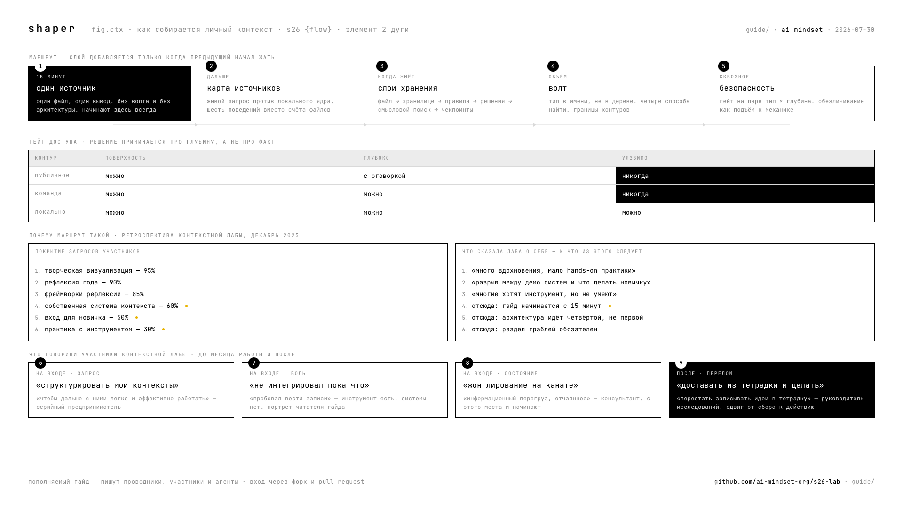

# гайд · сборка личного контекста

рабочий гайд к **элементу 2 «контекст»** программы S26: аудит жизни, инвентаризация поверхностей, чистка сохранёнок — чтобы агент получил профиль человека, а не догадки.

нужен на **pre-lab и W1**: там участник собирает входной документ и context layer, на который дальше встают состояние, агенты и форма. без этого шага остальная дуга висит в воздухе.

---

## почему этот гайд вообще пишется

в декабре 2025 AI Mindset провели четыре сессии контекстной лабы. по её итогам собрали честную ретроспективу: сравнили, что участники просили во вступительных сообщениях, с тем, что реально получили.

| запрос участников | покрытие |
|---|---|
| творческая визуализация | 95% |
| рефлексия года | 90% |
| фреймворки рефлексии | 85% |
| нетворкинг и парные сессии | 80% |
| **собственная система контекста** | **60%** |
| **вход для новичка** | **50%** |
| **практика с инструментом** | **30%** |

сильное было там, где работа шла с человеком. провал — ровно там, куда целится этот гайд. формулировки из той же ретроспективы:

> «много вдохновения, но мало hands-on практики по созданию собственной системы»

> «разрыв между демо продвинутых систем и что делать новичку — участники отмечали фрустрацию»

> «многие хотят Obsidian, но не умеют»

гайд написан против этих трёх строк. поэтому он начинается с пятнадцати минут, а не с архитектуры.

## для кого

портрет читателя — дословные фразы участников декабря:

> «пробовал вести записи в Obsidian — не интегрировал пока что»

> «Obsidian, 4K+ заметок... хочу уверенность, что мой стек это действительно что-то типа экзоскелета»

> «информационный перегруз, отчаянное жонглирование, стоя на канате»

человек, у которого инструмент уже есть, а системы нет. и человек, у которого нет ни того, ни другого, — для него первый раздел работает так же.

---

## карта гайда

порядок неслучаен: каждый следующий раздел нужен только тогда, когда предыдущий начал жать. **строить всё сразу — самый дорогой способ бросить на середине.**

| # | раздел | когда браться | статус |
|---|--------|---------------|--------|
| 01 | [минимальный старт](01-start.md) | сразу, первые 15 минут | черновик |
| 02 | [карта источников](02-sources.md) | когда первый источник собран | черновик |
| 03 | [хранение слоями](03-layers.md) | когда файлов стало больше десятка | черновик |
| 04 | [волт: типы, имена, поиск](04-vault.md) | когда перестал находить своё | черновик |
| 05 | [грабли](05-rakes.md) | прочитать заранее, вернуться при боли | черновик |
| 06 | [безопасность контекста](06-security.md) | до первой отправки во внешний сервис | черновик |
| 07 | [примеры](07-examples.md) | когда непонятно, как это выглядит у людей | черновик |
| 08 | [поколения метода](08-generations.md) | когда нашёл материалы прошлых потоков | черновик |
| 09 | [механика срабатывания](09-gates.md) | когда правила записаны и продолжают нарушаться | черновик |
| 10 | [что не сработало](10-failures.md) | до того, как начнёшь наводить порядок в собранном | черновик |

---

## одно правило, которое стоит услышать до всего остального

контекст, который лежит текстом, читается один раз на старте и дальше проигрывает вниманию. контекст, встроенный в момент действия, срабатывает независимо от того, помнишь ты о нём или нет.

практическое следствие: правило, записанное в заметку, работает хуже правила, которое останавливает тебя в момент, когда ты его нарушаешь. собирая контекст, спрашивай не «где это лежит», а **«что произойдёт, когда это понадобится»**.

---

## как связано с программой

| элемент дуги | что даёт гайд |
|---|---|
| 1 · зачем | ничего — цель ты называешь сам на открытии |
| **2 · контекст** | **весь гайд** |
| 3 · состояние | собранный контекст — то, на что встаёт поток |
| 4 · агенты | профиль и context layer — вход агентного цикла |
| 5 · люди | карта источников — язык сравнения подходов |
| 6 · форма | контекст-слой одного процесса едет в финальный артефакт |

домашние шаги открытых эфиров складываются в ту же воронку: где теряется внимание → какой процесс дорогой → первая страница личной конституции → первый агентный запуск. гайд встаёт между вторым и третьим шагом.

---

## как гайд растёт

он не написан раз и навсегда. пополняется после каждой сессии, и не только авторами лабы — участниками тоже. правила и формат: **[CONTRIBUTING.md](CONTRIBUTING.md)**.

---

## авторы

| кто | что внёс |
|-----|----------|
| **Александр Поваляев** — AI Mindset | метод сборки, границы контуров, материалы контекстной и зимней лабораторий |
| **Александр Васильев** — Бесперебойник | слои хранения, механика срабатывания, раздел «что не сработало» |
| **агенты контура** — Claude, Codex, JARVIS | цифры, снятые с работающих систем, разбор архивов, сведение |

материал собран из контекстной лаборатории (8–21 декабря 2025, четыре сессии), зимней лаборатории (19 января – 16 февраля 2026, семь выходных интервью) и рабочих контуров авторов.

дальше гайд пишут те, кто им пользуется. **имена соавторов добавляются в эту таблицу по мере вклада** — так же, как добавляются разделы.

---

*часть репозитория [s26-lab](../README.md) · built in the open · ai mindset, 2026*
